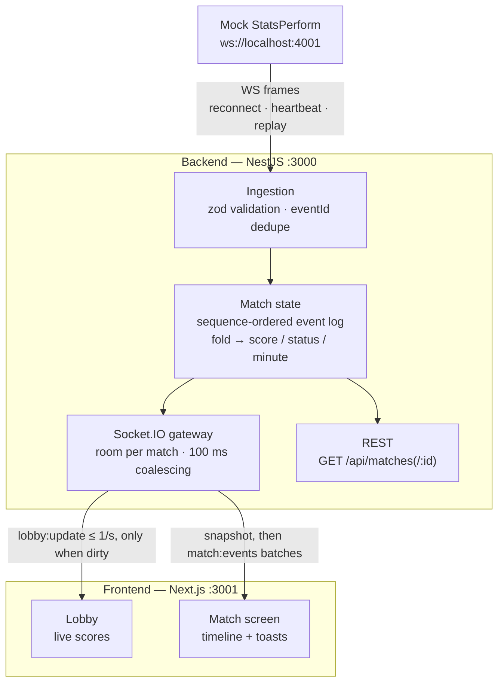

# Koora Break — Live Match

Real-time match event: a mock StatsPerform feed → NestJS backend → fan-out to per-match subscribers over Socket.IO → Next.js live-scores UI.

## Quick start

```bash
npm install
npm run dev-with-mock-server
```

Then open **http://localhost:3001**. That's it — the second command starts all three processes:

| Process | Where | What it does |
|---|---|---|
| Mock StatsPerform | `ws://localhost:4001` | Streams fixtures + events for 12 staggered matches (1 match minute = 1 real second, one round ≈ 2 min — restart it for a new round) |
| Backend (NestJS) | `http://localhost:3000` | Ingests + validates the feed, holds match state, fans out over Socket.IO; REST: `GET /api/matches`, `GET /api/matches/:id` |
| Frontend (Next.js) | `http://localhost:3001` | Lobby with live scores + a per-match screen with timeline and event toasts |

Other scripts: `npm run mock` / `npm run backend` / `npm run frontend` run each process alone; `npm run dev` runs backend + frontend only (useful when the mock is already running). Requires Node ≥ 18. Env overrides: `PORT` (backend), `MOCK_URL` (provider address).

## Architecture



**Key decisions:**

- **Shared wire contract (`@koora/shared`)** — all three apps import the same types; the backend's zod schemas are compile-time locked to them, so contract drift fails the build instead of shipping bugs.
- **State is a fold over an ordered event log** — events insert by provider `sequence`, then score/status/minute are recomputed. Out-of-order and duplicate delivery become non-problems by construction.
- **One Socket.IO room per match** — routing happens once per event on the server; `subscribe` replies with a full snapshot, then live batches, so there's no gap between current state and future events.
- **Push-based lobby** — broadcast at most once per second and only when something changed; clients never poll.
- **Hostile provider link** — every frame is schema-validated (garbage counted and dropped), with backoff reconnect, heartbeat, and replay + dedupe to reconverge after drops.
- **Burst coalescing** — the first event to a quiet room goes out immediately; a 100 ms window batches whatever follows.


## How each requirement was solved (short version)

- **Feed:** single-file mock server streams fixtures + scripted events over WebSocket, staggered kick-offs, full replay to every new consumer.
- **Ingestion:** every inbound frame is untrusted — JSON-parse + zod validation at the boundary; invalid frames are counted and dropped, the pipeline never crashes.
- **Match state:** per-match ordered event log folded into score/status/minute on every accepted event; `eventId` set dedupes redelivery.
- **Fan-out:** Socket.IO room per match; snapshot on subscribe, then coalesced event batches carrying the authoritative derived state.
- **Lobby:** pushed `lobby:update` (match list + provider status), throttled to 1/sec and sent only when dirty.
- **Frontend:** lobby with live scores/status and score-flash; match screen with score header, two-sided timeline, and animated goal/card toasts.
- **Resilience:** exponential-backoff reconnect, heartbeat against silently-dead sockets, replay + dedupe convergence after drops.

## Stretch goals

All four are implemented in the pipeline. 

- **Out-of-order events (implemented)** — the mock holds back ~12% of events by 2–4 match minutes; because state is a fold over the sequence-sorted log (and the client timeline also inserts by sequence), the view always converges to the correct score and order.
- **Late joiner (implemented)** — `subscribe` replies with a full snapshot (score, status, minute, complete timeline) before any live events, so a client joining at minute 60 renders the current state immediately; the same snapshot is served at `GET /api/matches/:id`.
- **Malformed events (implemented)** — every inbound frame is untrusted: JSON-parse + zod validation at the boundary, garbage and unknown event types are counted and dropped, and the pipeline never crashes.
- **Burst mode (implemented)** — the first event to a quiet room is emitted immediately, then a 100 ms window coalesces whatever follows — a derby burst costs a handful of messages and clients render each batch once.


